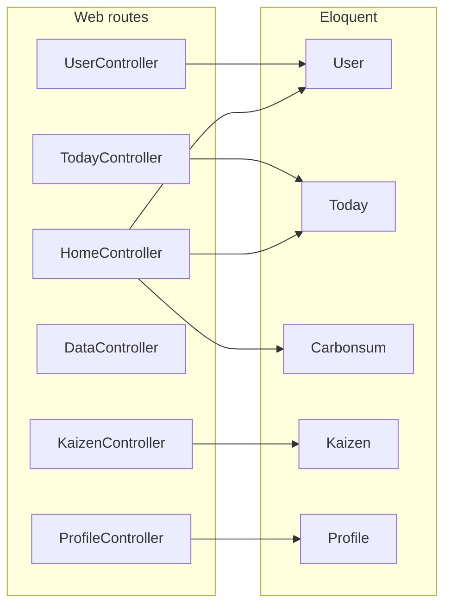

# Repository Guidelines

## Application Structure (This Repository)

This app helps users log **daily work and lifestyle activities** and view **carbon-related metrics** (e.g. `works_carbon`, `foods_carbon`, `move_carbon`, `life_carbon` on `Today` records). Most pages require authentication; parts of the UI and copy are **Japanese**.

### Tech stack and versions

- **Framework**: Laravel 9 (`laravel/framework ^9.19`), PHP **^8.0.2** — see root `composer.json`.
- **Auth**: Session-based web login plus **Laravel Sanctum** (used for `auth:sanctum` on API routes).
- **Front-end build**: **Vite 3** and `laravel-vite-plugin` — `npm run dev` / `npm run build` in `package.json`.
- **Project-specific**: Composer runs `scripts/apply-carbon-last-errors.php` on `post-autoload-dump`, `post-update-cmd`, and `post-install-cmd` (unrelated to the business model name “Carbon”).

### HTTP bootstrap and routing

- **Kernel**: `bootstrap/app.php` binds `App\Http\Kernel`.
- **Registration**: `app/Providers/RouteServiceProvider.php` loads `routes/api.php` with the `api` prefix and middleware group, and `routes/web.php` with the `web` group. Post-login home: `HOME = '/'`.

#### Web (primary surface)

In `routes/web.php`, most routes use the **`auth`** middleware:

| Path / area | Controller | Purpose |
|-------------|------------|---------|
| `/` | `HomeController@index` | Dashboard: `Carbonsum`, `Today` last-7-days trends, etc. |
| `/today` | `TodayController` | Daily activity entry and edit |
| `/kaizen` | `KaizenController` | Kaizen form |
| `/data` | `DataController` | Data page |
| `/about` | `AboutController` | About |
| `/profile` | `ProfileController` | User profile |

**Auth and users** (guest unless noted):

- Guest: `/login`, `/register`, `/forgot-password`, `/reset-password/{token}`.
- `UserController`: `POST /users` (register), `POST /users/authenticate` (login), `POST /logout` (authenticated).
- Password reset flows are implemented as **closures** in `web.php` (includes Japanese flash messages).

#### API

`routes/api.php` exposes essentially one protected route: **`GET /api/user`** with **`auth:sanctum`**, returning the current user. There is no separate REST resource API.

### `app/` layout

- **Controllers** (`app/Http/Controllers`): `HomeController`, `TodayController`, `KaizenController`, `DataController`, `AboutController`, `ProfileController`, `UserController`, plus base `Controller`.
- **Models** (`app/Models`):
  - `User` — `HasApiTokens` (Sanctum).
  - `Today` — large attribute set (work context, travel, meals, carbon fields); core domain entity.
  - `Carbonsum` — aggregated totals used on the home dashboard.
  - `Kaizen`, `Profile` — kaizen and profile features.
- **Note**: This repo is mostly **controllers + Eloquent models**. There is **no** `app/Support` directory or dedicated service layer yet; add shared logic there when it grows.

Standard Laravel pieces: `app/Http/Middleware`, `app/Providers`, `app/Console/Kernel.php`, `app/Exceptions/Handler.php`.

### Data layer

- **Migrations** (`database/migrations`): `users`, `profiles`, `todays`, `kaizens`, `carbonsums`, password resets, `failed_jobs`, `personal_access_tokens`, etc. Later migrations add `activity_date` (and related) on `todays` / `carbonsums`.
- **Tests**: `tests/Feature` and `tests/Unit`.

### Controller–model overview

## Project Structure & Module Organization

Beyond the application-specific layout above: Blade templates live in `resources/views`, front-end sources in `resources/js` and `resources/css`, and Vite output in `public/build`. Configuration is under `config/`; seeders and factories under `database/`. When introducing shared non-controller code, prefer a clear home such as `app/Support` (not present today).

## Build, Test, and Development Commands

Install PHP dependencies with `composer install` and JS dependencies with `npm install`. Run the local server via `php artisan serve` and compile assets in watch mode with `npm run dev`. Use `npm run build` for production asset bundles. Execute the Laravel test suite using `php artisan test`; call `phpunit` directly for more granular options. Clear caches (`php artisan config:clear`, `php artisan cache:clear`) whenever configuration or route files change.

## Coding Style & Naming Conventions

Use PSR-12 for PHP (4-space indents) and follow Laravel idioms for controllers, requests, and resource classes. Prefer descriptive class names (e.g., `AccountReconciliationService`) and snake_case for database columns. Keep Blade templates concise and extract reusable components into `resources/views/components`. Front-end scripts should use ES modules and follow standard Prettier spacing; run `./vendor/bin/pint` before committing to auto-format PHP.

## Testing Guidelines

Organize tests by capability: end-to-end HTTP flows in `tests/Feature`, pure logic in `tests/Unit`. Name test methods with intent (`test_guest_cannot_access_dashboard`). Provide factories/seeds when touching the database. Aim to cover new controllers, jobs, and services with at least one Feature test. Run `php artisan test --parallel` before pushing to catch race issues early.

## Commit & Pull Request Guidelines

Write commits in the imperative mood (`Add dashboard authorization`) and keep them focused. Reference ticket IDs in the first line when applicable. Pull requests should describe the change, list verification steps (`php artisan test`, `npm run build`), and include screenshots or API samples for UI or contract updates. Request review from a teammate familiar with the affected module and ensure CI passes before merging.

## Environment & Security Notes

Copy `.env.example` to `.env` and set `APP_KEY` via `php artisan key:generate`. Never commit secrets or compiled assets. Use HTTPS for external callbacks and validate all webhooks in dedicated middleware under `app/Http/Middleware`.
